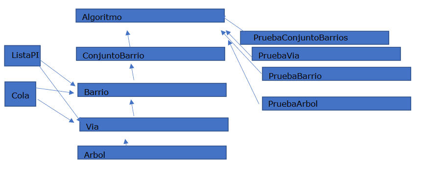

# Proyecto de Gestión de Datos Urbanos - OpenData Cáceres

Este proyecto se enfoca en el desarrollo de una aplicación para procesar datos disponibles en el portal Open Data Cáceres, relacionados con los barrios, calles y árboles de la ciudad. La aplicación consiste en una serie de algoritmos que extraen información y la representan para su análisis.

## Estructuras de Datos y Módulos

### Clases Principales

#### `Barrio`

- Representa un barrio de la ciudad.
- Gestiona las vías presentes en el barrio y sus atributos.
- Ofrece métodos para contar vías, obtener información sobre las mismas, trabajar con árboles y más.

#### `Via`

- Modela una vía o calle dentro de un barrio.
- Administra los árboles presentes en la vía y sus detalles.
- Incluye métodos para insertar árboles, trabajar con colas de prioridad, escribir información en archivos, contar árboles y más.

#### `Arbol`

- Representa los árboles presentes en las vías.
- Gestiona atributos como especie, diámetro, altura, entre otros.
- Proporciona métodos para manipular y obtener información detallada sobre los árboles.

## Decisiones de Diseño

Para abordar este proyecto, se ha optado por una estructura modular, con tres clases principales: `Barrio`, `Via` y `Arbol`. Cada una de estas clases maneja datos específicos y ofrece métodos para trabajar con ellos de manera independiente. La estructura general del diseño es la siguiente:

## Uso de las Clases

### `Barrio`

Esta clase permite gestionar los barrios, manejar las vías dentro de ellos y trabajar con la información asociada a estas vías, incluyendo los árboles presentes en cada una.

### `Via`

Representa las vías o calles dentro de un barrio y gestiona los árboles presentes en estas vías, permitiendo operaciones como inserción, conteo y manipulación de datos asociados.

### `Arbol`

Ofrece una estructura para representar y manipular los árboles presentes en las vías de la ciudad, con métodos para acceder a sus atributos y realizar comparaciones.
